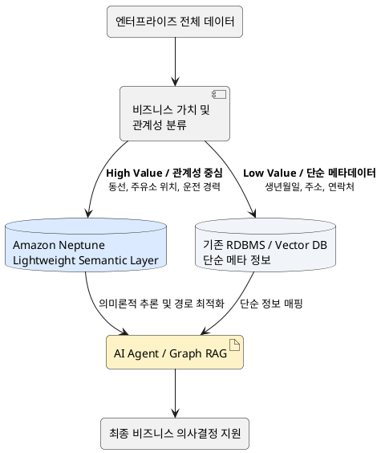

# Amazon Neptune 워크샵 후기: 지식 그래프의 현주소와 엔터프라이즈 도입 전략

최근 성공적으로 Amazon Neptune 기반의 지식 그래프(Knowledge Graph) 및 온톨로지(Ontology) 실습 워크샵을 마무리했습니다. 
저는 **RAG 기반 Agent를 개발하는 AI Engineer**로서 Vector DB를 활용한 일반적인 RAG 뿐 아니라 Neo4j와 같은 Graph DB를 활용한 Graph RAG에도 관심이 꾸준히 있었지만, 비용이 너무 큰 설계가 되어 비즈니스적 활용 방향을 여태 잡지 못하고 있는 상황이었습니다. 이번 경험을 통해 얻은 AI 업계 트렌드, 기술적 한계, 그리고 향후 아키텍처 방향성에 대한 고찰을 정리해 봅니다.

## 1. 지식 그래프와 온톨로지의 부상 배경

최근 엔터프라이즈 AI 시장에서 온톨로지와 지식 그래프에 대한 관심이 그 어느 때보다 뜨겁습니다.

- **Palantir의 나비효과:** Palantir가 자사의 '온톨로지(Ontology)'를 AI 에이전트와 결합하여 단순한 데이터 조회를 넘어선 물리적 비즈니스 액션(AIP)으로 시너지를 내기 시작하면서, 지식 구조화에 대한 시장의 기대치가 급상승했습니다.
- **Neo4j와 Graph RAG:** 그래프 DB의 선구자인 Neo4j 역시 기존 Vector DB의 한계(단순 의미 검색)를 극복하기 위해, 노드 간의 관계를 추론하는 Graph RAG 생태계를 주도적으로 이끌어가고 있습니다.
- **Amazon Neptune의 대응:** 이러한 흐름에 발맞추어 AWS 또한 완전 관리형 그래프 데이터베이스인 Amazon Neptune을 내세워, 클라우드 생태계 내에서 지식 그래프 서비스를 엔터프라이즈 고객에게 제공하고자 박차를 가하고 있습니다.

---
## 2. 지식 그래프의 핵심 개념: Neptune을 중심으로

### 2.1. Amazon Neptune이란? (Graph DB 관점)

Amazon Neptune은 수십억 개의 관계를 밀리초(ms) 단위로 탐색할 수 있도록 설계된 **AWS의 완전 관리형 그래프 데이터베이스**입니다. 기존 관계형 DB(RDBMS)가 '표(Table)' 형태로 데이터를 저장한다면, 그래프 DB는 데이터 간의 '관계(점과 선)'를 직접적으로 저장하고 쿼리하는 데 특화되어 있습니다.

- **멀티 모델 및 표준 쿼리 지원:** Neptune은 업계 표준인 **Property Graph**(노드와 엣지로 구성)와 **RDF**(주어-동사-목적어 형태) 모델을 모두 지원합니다. 쿼리 언어로는 **openCypher**를 비롯해 Gremlin, SPARQL을 사용할 수 있습니다.
- **클라우드 네이티브 확장성:** 컴퓨팅과 스토리지가 분리된 아키텍처를 사용하여 데이터 증가에 따라 스토리지가 자동 확장되며, 읽기 전용 복제본(Read Replica)을 통해 초당 수십만 건의 쿼리를 처리할 수 있습니다.
- **Neo4j와의 비교:** 그래프 DB의 대명사인 Neo4j가 단일 노드에서의 깊은 탐색과 자체적인 그래프 알고리즘(GDS)에 강점이 있다면, **Neptune은 AWS 생태계(S3, SageMaker, Bedrock 등)와의 유연한 통합, 클라우드 인프라 기반의 탄력적 확장성 및 보안**에 압도적인 강점을 가집니다. 워크샵에서 인프라 부담 없이 핵심 로직에만 집중할 수 있었던 이유도 이 때문입니다.

### 2.2. 온톨로지(Ontology)와 지식 그래프(Knowledge Graph)의 이해

워크샵의 핵심 주제였던 '온톨로지'는 쉽게 말해 **"현실 세계의 개념과 관계를 컴퓨터가 이해할 수 있도록 만든 의미론적 설계도"** 입니다. 이 설계도(온톨로지)를 바탕으로 실제 데이터(항공 노선, 고객 정보 등)를 채워 넣은 결과물이 바로 **'지식 그래프(Knowledge Graph)'** 입니다.

- **데이터에 '문맥(Context)'을 부여:** 단순한 'A공항'과 'B호텔'이라는 데이터가 아니라, "A공항은 B도시에 위치하고, 특정 TravelPersona를 가진 고객은 B도시의 C호텔을 선호한다"는 다단계 문맥을 형성하여 복잡한 의사결정을 돕습니다.
- **Palantir 온톨로지 vs 그래프 DB (Neptune):** 최근 AI 업계에서 화두인 Palantir(팔란티어)의 온톨로지는 데이터(지식)에 **'액션(행위)'까지 내장**하여 물리적 비즈니스 시스템을 직접 제어하는 디지털 트윈에 가깝습니다. 반면, Neptune과 같은 전통적인 그래프 DB는 **'지식의 구조화와 맥락 추론'**에 집중합니다. 즉, Neptune이 강력한 지식의 뼈대(노드와 엣지)를 제공하면, 개발자나 AI Agent(LLM)가 이를 바탕으로 액션을 수행하는 구조로 역할을 분담합니다.

### 2.3. 워크샵의 핵심 경험 및 비즈니스 임팩트

워크샵에서 다룬 내용은 최신 기술을 현업에 적용하는 완벽한 축소판이었습니다. 특히 다음 세 가지 포인트를 통해 깊은 인사이트를 얻을 수 있었습니다.

1.  **점진적 온톨로지 확장 (데이터 보강):**
    처음에는 공항-도시-국가라는 기본 항공 노선(Air-Routes)으로 시작하여, 이후 고객 세그먼트(TravelPersona, POI, Hotel)를 연결하며 지식 그래프를 확장했습니다. 이는 실제 비즈니스에서 **사일로화된(고립된) 데이터를 연결하여 초개인화된 추천 시스템을 구축**하는 과정과 동일합니다.
2.  **LLM과 그래프 DB의 만남 (Text-to-Cypher):**
    그래프 DB의 가장 큰 진입 장벽 중 하나는 openCypher와 같은 쿼리 언어 학습이었습니다. 하지만 워크샵에서 실습한 **Text-to-Cypher**는 사용자가 자연어로 질문하면 LLM이 이를 Cypher 쿼리로 변환해 줍니다. 이는 비개발자(마케터, 기획자)도 복잡한 데이터 탐색을 직접 할 수 있게 됨을 의미하며, 최근 각광받는 **Graph RAG (지식 그래프 기반 검색 증강 생성)** 의 핵심 기반이 됩니다.
3.  **시각화(Graph Explorer)를 통한 직관적 검증:**
    관계형 DB의 표 형태로는 파악하기 힘든 다단계 관계(Multi-hop)의 패턴을 GUI로 직접 눈으로 확인하며, 데이터 간의 숨겨진 인사이트를 발견하는 경험을 할 수 있었습니다.

---
## 3. 지식 그래프 플랫폼 심층 비교

워크샵 전후로 다양한 플랫폼을 비교하며 장단점을 파악할 수 있었습니다.

### 3.1. Graph DB 관점: Amazon Neptune vs Neo4j

이 비교는 **"그래프 데이터를 처리하는 엔진의 태생과 아키텍처가 어떻게 다른가?"** 에 초점이 맞춰져 있습니다.

| 구분                  | Amazon Neptune (AWS)                                                                                                                                                       | Neo4j                                                                                                                                                                                   |
| :-------------------- | :------------------------------------------------------------------------------------------------------------------------------------------------------------------------- | :-------------------------------------------------------------------------------------------------------------------------------------------------------------------------------------- |
| **태생 및 아키텍처**  | **클라우드 네이티브 (Cloud-Native)** 컴퓨팅과 스토리지가 분리된 AWS 완전 관리형 아키텍처.                                                                                 | **네이티브 그래프 (Native Graph)** 데이터가 디스크에 저장될 때부터 노드 간 포인터로 직접 연결되는 'Index-free adjacency' 구조.                                                        |
| **데이터 모델**       | **멀티 모델 (Multi-Model)** Property Graph(속성 그래프)와 RDF(시맨틱 웹 표준)를 모두 지원.                                                                                    | **단일 모델 (Single-Model)** Property Graph에만 집중.                                                                                                                                |
| **쿼리 언어**         | openCypher, Gremlin, SPARQL 지원.                                                                                                                                          | Cypher (Neo4j가 직접 개발한 언어).                                                                                                                                                      |
| **강점 (장점)**       | - **AWS 생태계 통합:** S3, SageMaker, Bedrock(LLM) 등과의 연동이 압도적으로 매끄러움. - **확장성 및 운영:** 스토리지 자동 확장, 읽기 복제본(Read Replica) 추가 등 인프라 관리가 거의 필요 없음. | - **성능:** 단일 노드에서 매우 깊고 복잡한 다단계(Multi-hop) 탐색 시 속도가 가장 빠름. - **알고리즘:** GDS(Graph Data Science) 라이브러리가 매우 강력하여 자체적인 그래프 분석에 탁월함. |
| **요약**              | **"확장성과 통합성을 갖춘 클라우드 만능 툴"**                                                                                                                              | **"극한의 탐색 성능을 지닌 그래프 스페셜리스트"**                                                                                                                                       |

**💡 워크샵 적용 포인트:** Amazon Neptune을 사용한 이유는, 복잡한 인프라 튜닝이나 설치 없이 AWS 환경에서 즉시 대규모 항공/고객 데이터를 로딩하고, LLM(Bedrock)과 연결하여 AI 서비스를 구축하는 **'엔드투엔드 파이프라인'** 을 경험하기 가장 좋기 때문입니다.

---

### 3.2. 순수 Ontology 관점: Neptune vs Palantir vs TypeDB

온톨로지는 단순한 데이터의 연결을 넘어 **"현실 세계의 개념, 규칙, 그리고 의미를 컴퓨터가 어떻게 이해하게 할 것인가?"** 에 대한 철학입니다. 세 플랫폼은 온톨로지를 다루는 목적과 방식이 완전히 다릅니다.
(제 개인적인 견해이니 너그러이 읽어주시면 감사하겠습니다.)

#### ① Amazon Neptune: 지식의 "저장소 (Storage)"

-   **온톨로지 접근법:** Neptune 자체는 온톨로지의 의미를 스스로 '이해'하지는 않습니다. 개발자가 설계한 온톨로지 구조(스키마)에 맞춰 데이터를 **충실하게 저장하고 빠르게 검색**해 주는 캔버스 역할을 합니다.
-   **특징:** W3C 표준인 RDF/OWL 모델을 지원하므로, 학계나 산업계의 표준 온톨로지를 그대로 가져와 저장할 수 있습니다.
-   **역할:** "네가 설계한 지식 지도를 내가 안전하고 빠르게 보관해 줄게."

#### ② TypeDB: 지식의 "추론기 (Reasoning)"

-   **온톨로지 접근법:** TypeDB는 태생부터 **'온톨로지 네이티브(Ontology-native)'** 데이터베이스입니다. 단순한 점과 선이 아니라, 데이터 간의 '역할(Role)'과 '규칙(Rule)'을 데이터베이스 자체에 내장합니다.
-   **특징:** 강력한 **자동 추론(Inference) 엔진**을 가지고 있습니다. 예를 들어, "A는 B의 부모다", "B는 C의 부모다"라는 사실만 입력해도, TypeDB는 온톨로지 규칙을 통해 "A는 C의 조부모다"라는 사실을 데이터베이스 레벨에서 스스로 추론해 냅니다.
-   **역할:** "네가 규칙(온톨로지)만 알려주면, 내가 숨겨진 의미와 새로운 지식을 스스로 찾아낼게."

#### ③ Palantir (Foundry/AIP): 지식의 "실행기 (Action & Operation)"

-   **온톨로지 접근법:** Palantir에서 온톨로지는 단순한 지식 그래프가 아니라, 기업의 **'디지털 트윈(Digital Twin)'이자 운영 체제**입니다.
-   **특징:** 데이터와 관계뿐만 아니라 **'액션(Action)'** 을 온톨로지에 결합합니다. 예를 들어 '항공기'라는 노드에 '유지보수 일정 변경하기'라는 비즈니스 로직(버튼)이 내장되어 있습니다. AI 에이전트나 사용자가 이 온톨로지를 통해 단순히 데이터를 조회하는 것을 넘어, 실제 현실의 비즈니스 시스템을 직접 제어하고 변경합니다.
-   **역할:** "지식을 바탕으로 현실 세계의 비즈니스 의사결정을 내리고, 즉시 행동(Action)으로 옮기게 해줄게."

---

#### 🎯 총정리

세 가지 온톨로지 플랫폼을 하나의 비즈니스 시나리오로 비유하자면 다음과 같습니다.

> **[항공사 결항 사태 발생 시]**
>
> -   **Neptune:** "현재 결항된 항공편과 연결된 승객 300명의 명단과 그들의 최종 목적지, 선호 호텔 데이터를 0.1초 만에 찾아줍니다." (탐색과 연결)
> -   **TypeDB:** "승객 A는 VIP 등급이고, 내일 중요한 회의가 있다는 규칙을 추론하여, 이 승객의 불만족 위험도가 '매우 높음' 상태임을 자동으로 계산해 냅니다." (의미 추론)
> -   **Palantir:** "위험도가 높은 승객 A에게 대체 항공편을 예약하고, B호텔에 보상 숙박을 자동으로 결제하는 '액션'을 실행합니다." (비즈니스 운영)

워크샵에서는 **Neptune을 활용하여 온톨로지의 가장 뼈대가 되는 '지식의 저장과 탐색(연결)'** 을 실습했습니다. 이 뼈대가 튼튼하게 구축되어야 향후 TypeDB처럼 고도화된 추론을 하거나, Palantir처럼 AI 기반의 액션을 수행하는 시스템으로 확장할 수 있습니다.

워크샵의 **"고객 세그먼트 데이터 보강(Notebook 04)"** 세션에서 단순한 데이터가 어떻게 '문맥을 가진 지식'으로 변하는지를 통해 온톨로지의 진정한 가치를 체감할 수 있었습니다.

---

## 4. 현실적인 장벽: 막대한 비용과 성능 오버헤드

하지만 기술적 이상과 현업의 도입 사이에는 여전히 큰 괴리가 존재합니다. 이번 워크샵과 리서치를 통해 느낀 가장 큰 허들은 바로 **'비용(Cost)'과 '속도(Performance)'** 입니다.

모든 엔터프라이즈 데이터를 무작정 그래프 DB에 밀어 넣는 것은 최악의 아키텍처가 될 수 있습니다. 수억 건의 노드와 엣지를 생성하고 유지하는 데 따르는 클라우드 인프라 비용(Neptune 인스턴스, 스토리지, I/O 비용)이 막대할 뿐만 아니라, 복잡한 다단계 탐색(Multi-hop 쿼리) 시 응답 지연(Latency)이 발생하여 실시간 서비스에 부적합할 수 있습니다.

## 5. 대안적 접근: "Lightweight Semantic Layer" 아키텍처

이러한 한계를 극복하기 위해, Neptune과 같은 그래프 플랫폼을 **'가벼운 시맨틱 레이어(Lightweight Semantic Layer)'** 로 활용하는 하이브리드 전략을 제시합니다.
핵심은 **"비즈니스 기여도가 높은 핵심 관계성 데이터만 분리하여 온톨로지에 적재"** 하는 것입니다.

(해당 접근은 워크샵 당시 설명해주신 실제 데이터 엔지니어분과의 토론을 통해 구체화된 예시입니다.) 

💡 **Use Case: 물류/배송 도메인 적용 예시**

물류 회사에서 배송 최적화 AI를 구축한다고 가정해 보겠습니다.

-   **[Graph DB 적재 - High Value]:** 짧은 동선 패턴, 기름값이 싼 주유소 위치, 기사의 운전 경력 및 특화 노선 등 **'추론과 의사결정에 직접적인 영향을 미치는 관계형 정보'** 만 Neptune에 적재합니다.
-   **[기존 DB 적재 - Low Value]:** 기사의 생년월일, 집 주소, 휴대폰 번호 등 관계 추론에 불필요한 단순 고유 메타데이터는 기존 RDBMS나 Document DB에 남겨둡니다.

이러한 분리 아키텍처를 채택하면 그래프 DB의 연산 부하와 스토리지 비용을 획기적으로 줄이면서도, Graph RAG가 주는 높은 수준의 추론 성능은 그대로 취할 수 있습니다.

## 6. 지식 그래프 생태계의 현재 위치와 미래 전망

최신 웹 검색 및 업계 동향을 종합해 보았을 때, Amazon Neptune, Neo4j, TypeDB 등 **순수 온톨로지/그래프 플랫폼들은 아직 보편적인 엔터프라이즈 프로덕션 환경에 전면 도입하기에는 '시기상조'** 라는 결론을 내렸습니다.

-   **학습 곡선과 인프라 장벽:** Cypher, Gremlin, SPARQL 등 생소한 쿼리 언어에 대한 개발팀의 학습 곡선이 높고, 초기 스키마(온톨로지) 설계에 너무 많은 시간과 전문가(Ontologist)가 필요합니다.
-   **비용 효율성의 부재:** 명확한 ROI가 입증되지 않은 상태에서 대규모 그래프 클러스터를 유지하는 것은 기업 입장에서 부담스럽습니다.

**미래 전망:** 하지만 기술은 빠르게 성숙하고 있습니다. 최근 LLM이 텍스트에서 자동으로 지식 그래프를 추출해 주는 도구(LLMGraphTransformer 등)가 발전하고 있으며, 인메모리 기반의 그래프 엔진(Neptune Analytics 등)이 출시되며 속도 문제도 개선 중입니다. 비용이 안정화되고 도구가 추상화되는 시점(2~3년 내)에는 엔터프라이즈 수요가 폭발적으로 증가할 것으로 예상됩니다.

## 7. 결론 및 향후 계획 (Next Steps)

현재 시점에서는 무리하게 순수 Graph DB를 도입하기보다는, 전통적인 Vector DB 기반에 잘 설계된 Semantic Layer(메타데이터 필터링, 하이브리드 검색)를 얹어 비용 효과적인 RAG 시스템을 우선 구축하는 것이 현명한 접근입니다.

하지만 지식 그래프가 그리는 "현실 세계의 완벽한 디지털 트윈화 및 추론"이라는 비전은 강력합니다. 당장의 전면 도입은 유보하지만, Knowledge Graph 생태계의 발전과 Graph RAG 기술의 성숙도에 대해서는 앞으로도 꾸준히 리서치하고 PoC를 진행할 예정입니다.

다음에는 한 단계 레벨을 낮춰, Graph DB와 Vector DB를 결합한 Hybrid RAG에 대한 내용을 준비하려고 합니다.
그 다음에 또 한 단계 레벨을 낮춰, 효율적인 Text-to-Cypher 아키텍처에 대해 Agentic AI 관점에서 유익한 내용이 될 수 있도록 준비해보겠습니다.

감사합니다.